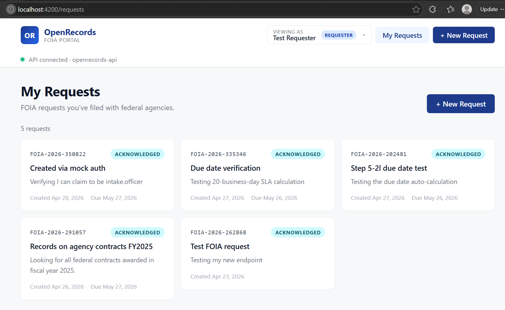
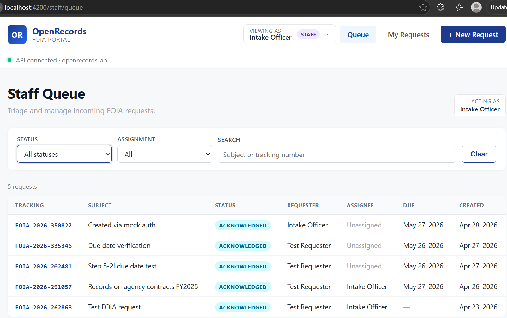
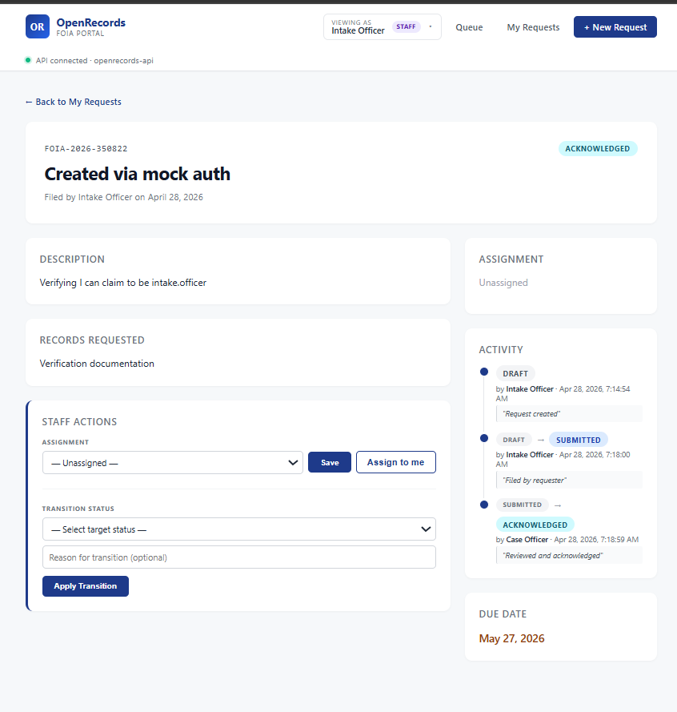

# OpenRecords

A FOIA (Freedom of Information Act) Request Management Portal demonstrating modern federal-grade full-stack development.

Submitted as a portfolio project for federal full-stack developer roles emphasizing Angular, Java, RESTful microservices, AWS readiness, and Section 508 accessibility.

## What's Built

A working two-sided portal with end-to-end data flow:

**Citizen portal** — file FOIA requests, track status across an 11-state workflow (DRAFT → SUBMITTED → ACKNOWLEDGED → ASSIGNED → UNDER_REVIEW → ... → CLOSED), and view request details.

**Backend API** — RESTful endpoints with RFC 7807 ProblemDetail error responses, JPA Specifications for filtered queries, optimistic locking, audit-trail history, and 20-business-day SLA due-date calculation.

**Database** — Schema managed via Flyway migrations (V1–V4), enforced state-machine via CHECK constraints, partial indexes for staff queue queries.

## Screenshots

### Citizen portal


### Staff queue with filters


### Detail page with staff actions and audit trail


## Architecture Highlights

- **State-machine domain model** — `FoiaRequestStatus` with allowed-transition rules enforced in service layer; invalid transitions return HTTP 422 with structured error.
- **Audit trail** — every status change writes a `foia_request_status_history` row in the same transaction as the status update, ensuring consistency.
- **RFC 7807 error responses** — global exception handler returns standardized ProblemDetail JSON for 400/404/422/500, never leaking stack traces.
- **20-business-day SLA calculation** — `BusinessDayCalculator` skips weekends and US federal holidays per 5 U.S.C. § 6103.
- **Filtered queue queries** — JPA Specifications compose dynamic WHERE clauses for staff filtering by status, assignee, due-date proximity, and free-text search.
- **Configuration via environment variables** — no secrets in source; dev defaults make the project clone-and-run.
- **Layered architecture** — Controller → Service (transactional) → Repository → Entity, with mappers separating wire format (DTO) from storage (entity).

## Stack

| Layer | Technologies |
|---|---|
| Frontend | Angular 18, TypeScript, SCSS, Reactive Forms, Signals |
| Backend | Java 21, Spring Boot 3.5, Spring Data JPA, Spring Validation |
| Database | PostgreSQL 16, Flyway, JPA Specifications |
| Infrastructure | Docker Compose, environment-based config |
| Tooling | Maven 3.9, npm, Logback rolling file logs |

## Repository Structure
openrecords/
├── openrecords-api/        # Spring Boot backend (Java 21 + Maven)
├── openrecords-web/        # Angular 18 frontend
├── openrecords-infra/      # docker-compose.yml (Postgres + pgAdmin)
└── docs/                   # Architecture notes

## Prerequisites

Java 21, Maven 3.9+, Node.js 20 LTS, Angular CLI 18, Docker Desktop.

## Local Development

```bash
# 1. Start Postgres + pgAdmin
cd openrecords-infra
cp .env.example .env       # one-time setup
docker compose up -d

# 2. Run backend (separate terminal)
cd openrecords-api
./mvnw spring-boot:run     # http://localhost:8080

# 3. Run frontend (separate terminal)
cd openrecords-web
npm start                  # http://localhost:4200
```

### Demo data

Seeded test users (BCrypt password: `password123`):

| Role | Email | Use |
|---|---|---|
| REQUESTER | testuser@example.com | Files FOIA requests via citizen portal |
| STAFF | intake.officer@example.com | Triage and acknowledgement |
| STAFF | case.officer@example.com | Records review |

The Angular UI currently runs as the test requester (auth/JWT planned for Phase 6).

## Environment Variables

Sensible defaults exist for all values. Override only for production or custom dev setups.

### Backend (Spring Boot)

| Variable | Default | Purpose |
|---|---|---|
| `OPENRECORDS_DB_URL` | `jdbc:postgresql://localhost:5432/openrecords` | JDBC connection |
| `OPENRECORDS_DB_USER` | `openrecords` | DB user |
| `OPENRECORDS_DB_PASSWORD` | `openrecords_dev_password` | DB password |
| `OPENRECORDS_ADMIN_USER` | `admin` | Bootstrap admin |
| `OPENRECORDS_ADMIN_PASSWORD` | `admin` | Bootstrap admin password |

### Infrastructure (Docker Compose)

| Variable | Default | Purpose |
|---|---|---|
| `POSTGRES_DB` | `openrecords` | Database name |
| `POSTGRES_USER` | `openrecords` | Postgres superuser |
| `POSTGRES_PASSWORD` | `openrecords_dev_password` | Postgres password |
| `PGADMIN_DEFAULT_EMAIL` | `admin@example.com` | pgAdmin login |
| `PGADMIN_DEFAULT_PASSWORD` | `admin` | pgAdmin password |

### Production Deployment

Never commit production credentials. Inject via:

- AWS ECS task definitions referencing Secrets Manager
- Kubernetes Secrets
- HashiCorp Vault

Rotate passwords on a regular schedule.

## Roadmap

| Phase | Status | What |
|---|---|---|
| Phase 1: Infrastructure | ✅ Done | Docker Compose, Postgres, pgAdmin |
| Phase 2: Backend scaffold | ✅ Done | Spring Boot 3.5, Flyway, health endpoint |
| Phase 3: Frontend scaffold | ✅ Done | Angular 18 with proxy and health check |
| Phase 4a: FOIA CRUD | ✅ Done | Create + list + retrieve API endpoints |
| Phase 4b: Angular UI | ✅ Done | Form, list, and detail pages |
| Phase 5: Staff console | 🚧 In progress | State machine, assignment, SLA, queue filtering |
| Phase 6: Authentication | Planned | JWT, login, registration, email verification |
| Phase 7: Notifications | Planned | Email triggers (Spring Mail + Thymeleaf + MailHog) |
| Phase 8: Deployment | Planned | AWS ECS + RDS + S3 |

## License

MIT — see [LICENSE](LICENSE).